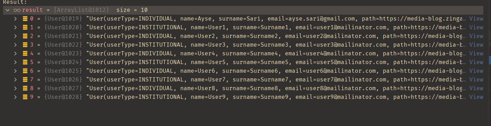

# HepsiEmlak Homework 1

## HepsiEmlak Soru 1

89 sayısının palindromunu bulmak için 58 kez zincirleme olarak tekrarlamamız gerek.

## HepsiEmlak Soru 2

Methodu çağırırken, derleyici hangi sınıf methodunun çağrılacağını ve hangi sınıf methodunun önceliği aldığını belirleyemez.

C++ çoklu kalıtımı destekler miras aldığı sınıfların constructorlarını sırayla çağırır.Örneğin yukarıda resimdeki kodu C++ kodu gibi düşünürsek Question2 classında Parent1 Parent2 den önce çağrılır.

## HepsiEmlak Yapı Tasarımı Soru 3

#### UML Diagramı

Model yapısında Advert(İlan),User(Kullanıcı),RealEstate(Gayrimenkul),Message(Mesaj),Category(Kategori),Image(Resim),
City(İl),County(İlçe) dan oluşuyor.Birde BaseEntity classı oluşturdum bütün classlardaki ortak alanları burada topladım kod tekrarı olmaması için.

##### Advert Class 
Modeli ilk çıkardığım zaman Advert classına ihtiyaç duymadım çünkü hepsiemlak sitesini incelediğim zaman bir ilan oluşturmak istediğimde ilana ait 2 özellik vardı.Bunlar title ve description geri kalan bütün özellikler RealEstate classına aitti.Daha sonra hepsiemlak benzeri siteleri gezdim ve onlarda da bu şekilde olduğunu gördüm ve bende Advert classını hiç açmayıp RealEstate class içine advertTitle ve advertDescription eklemeye karar verdim.(Telegramda modellere bağlı mı kalmalıyız yoksa çıkarabilir miyiz diye sormuştum bu yüzden sordum).Bu bana mantıklı geldi sonuçta Advert classının sadece 2 özelliği için tablo açmak mantıklı gelmedi ama sonra derste çıkardığımız modeli inceledim ve içinde ilana ait özellikler vardı.Bunlar ne kadar süre ilan yayında kalsın,öne çıkarılması için talimat verildiyse eğer onun degeri,ilana bakan kullanıcı sayısı gibi özellikler ekledik ve bunlar Advert özellikleri olduğu için ben Advert class'ı açmaya karar verdim.Adver classı içindeki alanlar resimdeki gibidir.

Advert içindeki ilişkili yapılar
* private List<User> reviewed;  Burda bir ilana birden fazla kullanıcı bakmış olabilir bir kullanıcı birden fazla ilana bakabilir.ManyToMany ilişkisi var
* private User owner; Bir ilanı bir kullanıcı yayınlamıştır ve bir user birden fazla ilan yayınlayabilir ManyToOne ilişkisi var.
* private RealEstate realEstates;  Bir ilanın bir gayrimenkul'u vardır.Bir Gayrimenkul bir ilana aittir.OneToOne ilişkisi var.

##### User Class
User class içeriği aşağıdaki resimdeki gibidir.

User içindeki ilişkili yapılar
* private List<RealEstate> realEstateList; Bir kullanıcının birden fazla ilanı olabilir bir ilan bir kullanıcıya ait.ManyToOne ilişkisi var.
* private Set<RealEstate> favorite; Bir ilanı birden fazla kullanıcı favorilere ekleyebilir bir kullanıcı birden fazla ilan favorileyebilir.ManyToMany ilişkisi
* private List<Message> messageList; Bir kullanıcının birden fazla mesajı olabilir bir mesaj bir kullanıcıya aittir.ManyToOne ilişki.

##### Message Class
private User sender; bir kullanıcının bir göndericisi vardır.
private User receiver;bir kullanıcının bir alıcısı vardır.
content,title,seen,sentDate,readDate alanlarını koydum.

###### Burda message entitysinde farklı şeyler düşündüm ancak basit tutmak adına bu şekilde yaptım.Aklımdaki model şu şekildeydi bir Room classı daha açarım Room ve Message arasında ManyToOne ilişkisi tutarım Room un içinde roomId roomToken creationDate ve ManytoOne ilişkisi Message tablosunu tutardım.roomToken ile iki kullanıcının erişimini sağlardım.User ilede Room ilişkisi olurdu oda bir userın birden fazla room'u bir roomun 2 kullanıcısı olabilir bu yüzden ManyToMany ilişkisi olurdu burdada.

###
##### City ve County Class
City ve county diye iki ayrı entity oluşturdum.City class içinde name,numberPlate ve County tablosuyla ilişkisi var bir ilin birden fazla ilçesi olabilir ManyToOne ilişkisi var.
County içinde name ve City tablosuyla ilişkisi var.Bir ilçe bir ile aittir.

##### Image Class
Burda path ve sort koydum.sort koyma sebebim yüklenen resimlere bir sıralama verebilmek ve bir ilana resim yüklendiğinde ilk yüklenen sort sayesinde en başta gözükecek.

##### Category Class
Hepsiemlak sitesinde 2 kategori alanı var.Kategori ve konut alt kategori diye ben ilk başta bunları iki ayrı tablo olarak düşündüm sonra aklıma başka bir model geldi.Category class'ı içinde parent_id ve name alanları tuttum.Modeli anlatan görsel ekte.

Bu yapıda bir tree yapısı kullandım.parent_id boş olan kategoriler main kategori kısmına giriyor parent_id si dolu olan kategoriler sub kategori kısmına giriyor.Yani görselde id si 3 ve 4  parent_id leri dolu ve ikisininde parent_id si 2 olanlar sub kategori kısmına giriyor.
Şimdi hepsiemlakda yapı şu şekildeydi kategori seçilir ve ona bağlı olan sub kategoriler gelir.Benim yapımda da id si 2 olanı seçtiğimizi düşünelim sub kategorileri getirirken parent_id si 2 olanları getireceğim.
Tek tabloda tutmak istedim belki çok daha iyi bir yöntem vardır ama şimdilik bu şekilde yaptım :) 

##### RealEstate Class

RealEstate class içeriği aşağıdaki gibidir.

Burda hepsiemlak sitesinde ilan oluştura bastığımda gelen alanların çoğunu koymaya çalıştım.Burda sadece ilişkili olan yapıları açıklayacağım.

RealEstate içindeki ilişkili yapılar
* List<Image> imageList; Bir ilanın birden fazla resmi olabilir bir resim bir ilana aittir.ManyToOne ilişkisi var.
* Çok fazla enum kullandım ihtiyaç halinde bunlar içinde tablo yapılabilir ben basit olsun diye bu şekilde yaptım.
* private County county; Bir gayrimenkul bir ilçeye aittir.Bir ilçede birden fazla gayrimenkul olabilir.ManyToOne ilişkisi vardır.Sadece ilçe bilgisi eklemem yeterli olur çünkü ilçe içinde il bilgiside var.
* Category için hem sub hemde main categoryleri tutuyorum.Bir gayrimenkulun bir kategorisi olabilir bir kategorinin birden fazla gayrimenkulu olabilir.Burda MayToOne ilişkisi kurdum ancak buranın daha iyi düşünülmesi gerekiyor.Bir gayrimenkul örneğin müstakil ev hem arsa kategorisine hemde ev kategorisinde olabilir mi bu soruların cevabını iyi düşünüp ona göre karar vermek gerek.Bu kısım geliştirilebilir.

# Kod Çıktıları

## User Service Kod Çıktısı

## Advert Service Kod Çıktısı

## Real Estate Service Kod Çıktısı

## Message Service Kod Çıktısı

#### Message Listesi

#### Sistemde bulunan bütün mesaj başlıkları ve kullanıcıları 

## Filter Service Kod Çıktısı

#### 2. Filter

#### "ayse.sari@gmail.com" kullanicisinin favori ilanlari(baska mail adresinde de calisir methoda parametre geçtim)

